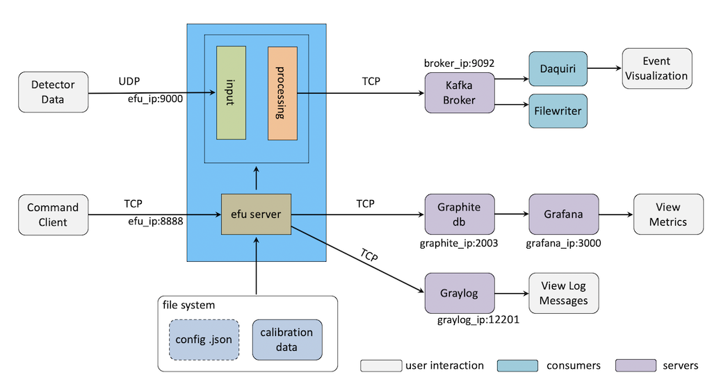

Event Formation Unit
====================

The Event Formation Unit (EFU) [#f1]_ is the main component for the ESS [#f2]_
data path. It receives timestamped digitised readouts from neutron detectors,
converts them into ESS neutron events ({time, pixel} tuples) and streams these
to Apache Kafka [#f3]_ .

  High level architecture view of the EFU.

.. note::

    If you consider using this project you should be aware that the code is subject
    to change without notice and that backwards compatibility is not guaranteed.

.. rubric:: Footnotes

.. [#f1] November 2018 Journal of Instrumentation 13(11):T11002-T11002 - http://dx.doi.org/10.1088/1748-0221/13/11/T11002
.. [#f2] European Spallation Source - https://www.ess.eu
.. [#f3] October 2018 Journal of Instrumentation 13(10):T10001-T10001 - http://dx.doi.org/10.1088/1748-0221/13/10/T10001

.. toctree::
    :caption: Install
    :maxdepth: 3
    :hidden:

    build

.. toctree::
    :caption: Running
    :maxdepth: 3
    :hidden:

    running
    utils

.. toctree::
    :caption: Advanced
    :maxdepth: 3
    :hidden:

    troubleshoot
    networkconn
    network
