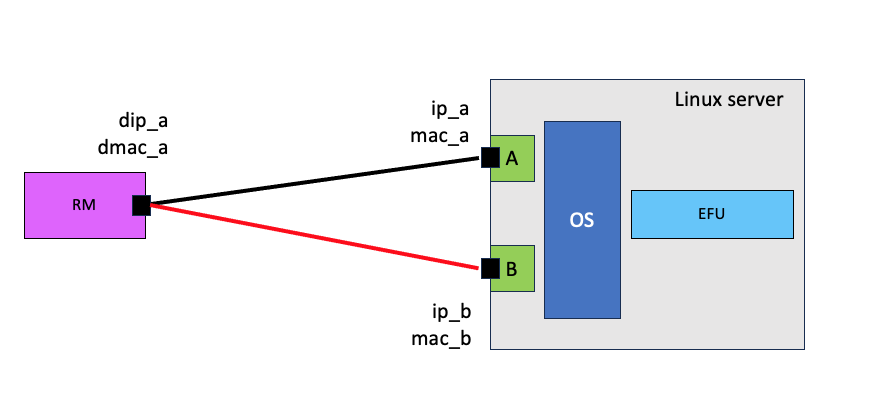
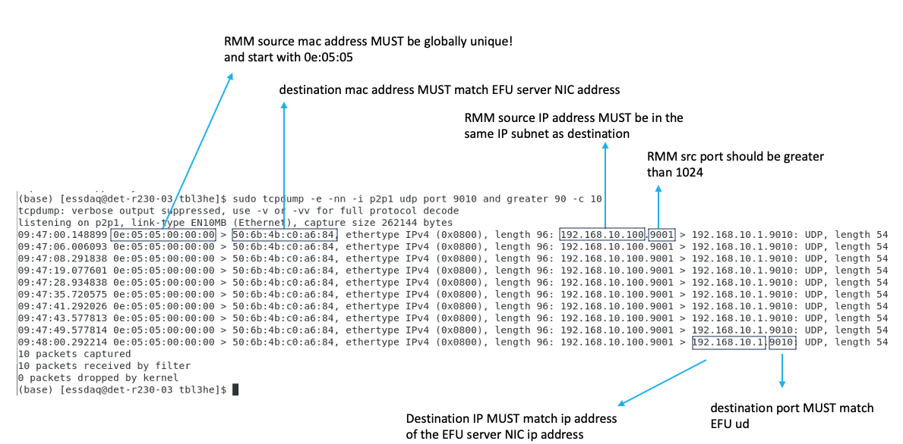

Network parameters
==================

The connection between RM and EFU is via a standard Ethernet interface.

The RM must be configured with the following network parameters

 * source and destination MAC addresses (smac, dmac)
 * source and destination IP addresses (sip, dip)
 * source and destination UDP port (sport, dport)

The crucial point is that these must match the corresponding parameters on the
EFU server. The figure below shows an example of one good configuration (black line)
and one bad configuration (red line).

  Ethernet connection between RM and EFU.

Debugging
=========

To check/validate your configuration you can use **tcpdump** as shown in the
figure below.

  Using tcpdump to prepare/validate network parameters

The key point is the command

.. code-block:: console

    $ sudo tcpdump -i p2p1 -nn -e udp port 9010

which can be supplemented with further arguments. This command
produces output similar to the figure above.

Direction of communication is shown by '>'. For example

.. code-block:: console

    $ 0e:05:05:00:00:00 > 50:6b:4b:c0:a6:84

    Device with MAC address 0e:05:05:00:00:00 is sending to device with
    MAC address 50:6b:4b:c0:a6:84

.. code-block:: console

    $ 192.168.10.100.9001 > 192.168.10.1.9010: UDP

    Host with IP address 192.168.10.100 is sending (UDP) data to host with IP
    address 192.168.10.1. (Data ids UDP, destination port is 9010
